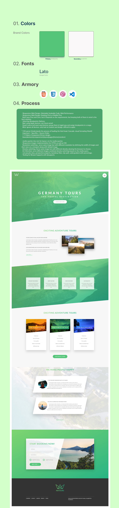

### Natures - FrontEnd Single Page Website

<br />
<p align="center">
  <a href="https://github.com/m90khan/Natures-Travel-agency-/">
    
  </a>

  <h3 align="center">Natures-  Front-End WebApp  </h3>

  <p align="center">
Tours Website <br />
    <a href="m90khan@gmail.com"><strong>Contact Me</strong></a>
    <br />
    <br />
    <a href="https://github.com/m90khan/Natures-Travel-agency-/">View Demo</a>
    
   </p>
</p>

## Table of Contents

- [About the Project](#about-the-project)
- [Process](#process)
- [Skills](#skills)
- [Code Snippet](#code)
- [Connect with me](#Contact)

---

### About the Project

- Natures is a tours agency front-end website.

Scripts:

- Package installation : npm install
- Start server : npm start

Layout: Float layout (BEM Model)
Duration: 9hrs - 3 days split

Live: https://github.com/m90khan/Natures-Travel-agency-/


 
#### Process

- Responsive Web Design, Maintable Scaleable Code, Web Performance
- Responsive Web Design: Desktop First vs Mobile First
  Both have Pros and Cons. but it Depends on the requirements. but keeping both of them in mind is the best solution.
- Selecting Breakpoints Options:
  Bad: using Apple devices, not future proof.
  Good: Look at all most used devices, group them in logial way and assign breakpoints in a range.
  BEst: Ignore all devices. only look at content and design. difficult to apply.

* CSS parser (Understands the process of loading the html head, Cascade, visual formating Model)
  Important > Specifity > Source Order.
  7-1 Pattern Component Driven design.
  (base|abstracts|componenets|layout|pages|themes|vendors)

- media queries Use rem for layout. em for media queries
- Responsive images: implementation for HTML as well as CSS
  Resolution switching : serve same image but with different resolution by defining the width of images and their sizes on a viewport along with default image.
  Density switching: Serve same image but with different density alowing the browser to choose.
  Art Direction: serve different Images combined density switching based on the media query
- not pseudo class, perspective property, backdrop-filter, clip-path, solid gradient with percentage,
- Testing for Brower Supports with @supports
- To run for devserver, uncomment the line in html <!-- <link rel="stylesheet" href="icons/styles.css" /> -->



---

### Skills

[][youtube]
[][youtube]
[][youtube]
[][youtube]
[][youtube]
[][youtube]
[][youtube]
<br />
<br />

---

### Code Snippet

```scss
.feature-box {
  padding: 5rem 2rem;
  background: rgba($color-white, 0.8);
  text-align: center;
  border-radius: 3px;
  box-shadow: 0 1.5rem 4rem rgba($color-black, 0.5);
  transition: all 0.3s;

  @include respond(tab-port) {
    padding: 2rem;
  }

  &__icon {
    font-size: 6rem;
    background: linear-gradient(to right, $color-primary-light, $color-primary-dark);
    display: inline-block;
    @supports (-webkit-background-clip: text) or (background-clip: text) {
      -webkit-background-clip: text;

      background-clip: text;

      color: transparent;
    }
  }
  &__text {
    font-size: $text;
    color: $color-grey-dark;
  }
  &:hover {
    transform: translateY(-2rem) scale(1.1);
    box-shadow: 0 0.5rem 6rem rgba($color-black, 0.5);
  }
}
```

---

### Connect with me:

[][youtube]

[][twitter]
[][linkedin]
[][instagram]
[][behance]
[][dribble]
<br />

---

[youtube]: https://www.youtube.com/channel/UC96rVfdTKsjZpREnH6CaCOw
[twitter]: https://twitter.com/m90khan
[linkedin]: https://www.linkedin.com/in/uxdkhan
[instagram]: https://www.instagram.com/uxd.khan/
[behance]: https://www.behance.net/Khan_Mohsin
[dribble]: https://dribbble.com/uxdkhan
